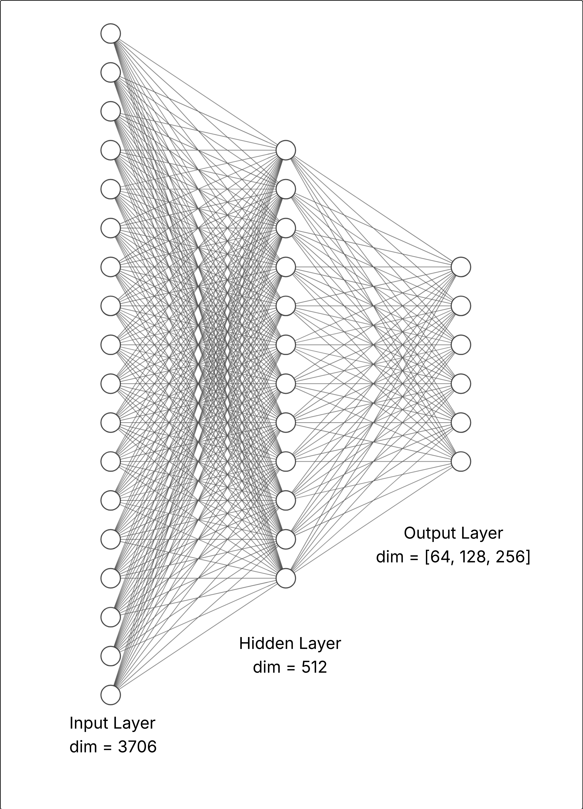
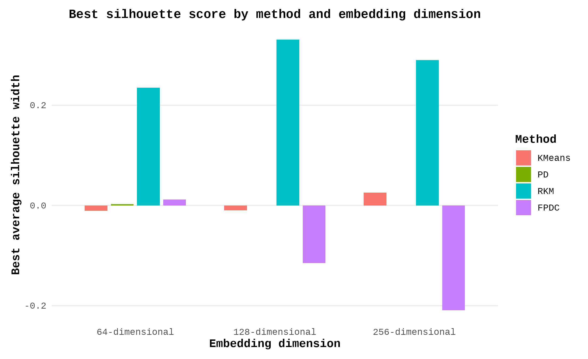
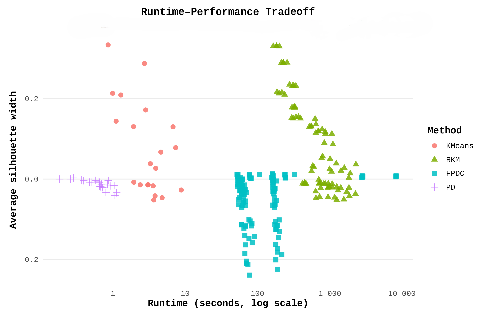
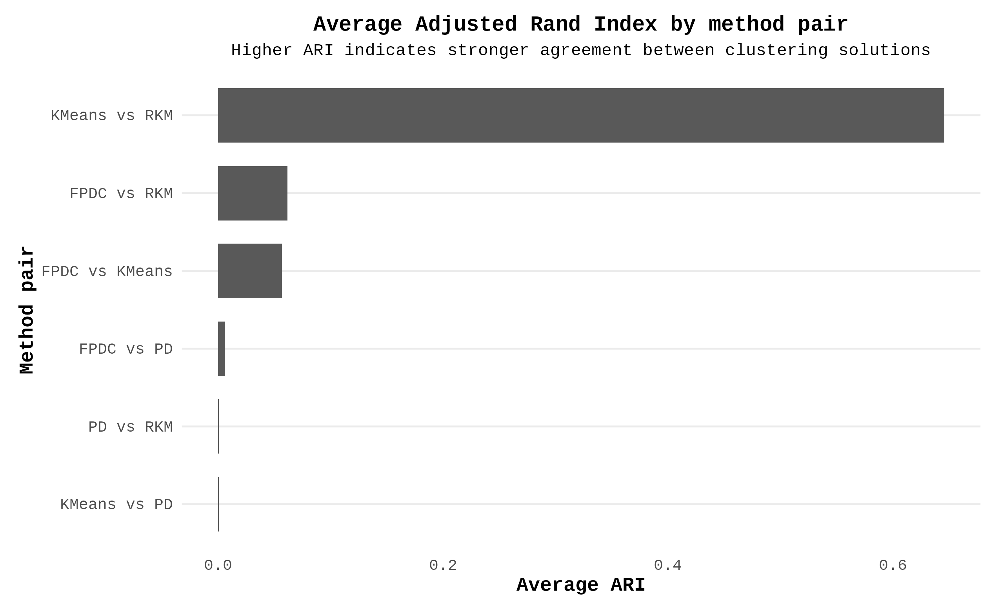
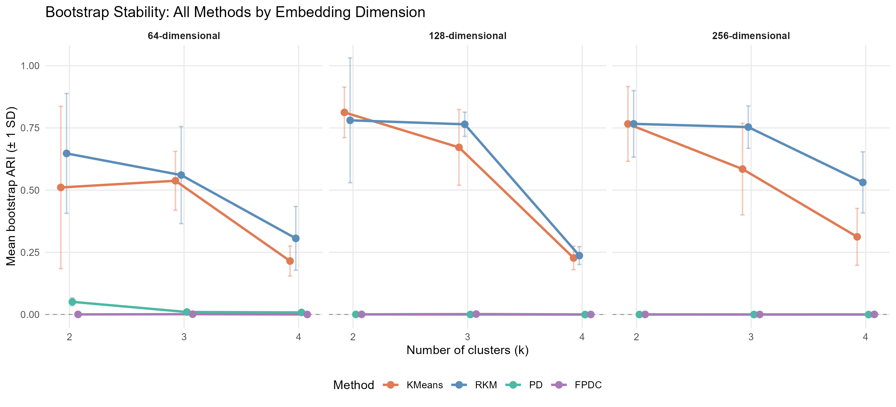

## Are users naturally grouped in embedding space?

**Research question:**  Do learned MovieLens user embeddings contain meaningful, stable cluster structure?


**Goal:** Compare how embedding dimension and clustering method affect:

- cluster quality
- stability
- interpretability


## From ratings to clustering results

**Dataset: MovieLens 1M**

- ~1 million ratings
- 6,040 users
- 3,706 movies

**Analysis pipeline**

Ratings → User-item matrix → MLP embeddings → Clustering → Validation (XXX fix diagram)


## Overview


**Goal:** Evaluate clustering structure in user embeddings from
MovieLens

::::: columns
::: {.column width="50%"}
**Dataset**

-   \~1 million ratings
-   6,040 users · 3,706 movies
-   Embeddings: 64, 128, 256 dimensions
:::

::: {.column width="50%"}
**Four Methods**

-   K-means
-   PD Clustering
-   Reduced K-means
-   Factorial PD
:::
:::::

**Key question:** How do embedding dimension and clustering method
affect quality, stability, and interpretability?

::: notes
Welcome. This project asks whether user behavior in movie ratings forms
meaningful groups. We learned dense embeddings from a neural network and
then applied four clustering methods. We have no ground truth labels so
all evaluation is internal. The talk is about 10 minutes — I'll cover
the methods, data, evaluation framework, and results.
:::

------------------------------------------------------------------------

## The Four Methods

::::: columns
::: {.column width="50%"}
**Hard assignment**

-   K-means

-   Reduced K-means
:::

::: {.column width="50%"}
**Probabilistic assignment**

-   PD Clustering

-   Factorial PD
:::
:::::

The four methods differ along two axes: **assignment** (hard vs.
probabilistic) and **representation** (full space vs. learned subspace).

::: notes
The methods form a 2x2 structure. K-means and RKM make hard assignments
— every user belongs to exactly one cluster. PD and FPDC make soft
assignments — users have partial membership in each cluster. RKM and
FPDC additionally reduce dimensionality, which can help when cluster
structure is clearer in a subspace than in the full embedding space.
These differences have direct implications for robustness, runtime, and
interpretability.

— minimizes within-cluster variance; fast and widely used; assumes
spherical clusters — simultaneously estimates a partition and a
low-dimensional subspace; concentrates on clustering-relevant directions
— soft memberships based on distance to cluster centers; robust to
overlap and noise — combines soft clustering with dimension reduction;
handles overlap and high dimensionality jointly
:::

------------------------------------------------------------------------

## Embedding Generation

::::: columns
::: {.column width="60%"}
1.  Build sparse user–item rating matrix (6040 × 3706)

2.  Mean center by movie; impute missing with zero

3.  Train MLP to compress each user into a dense vector

4.  Cluster in each embedding space separately

**Three embedding sizes:** 64, 128, 256 dimensions
:::

::: {.column width="40%"}
{width="90%"}
:::
:::::

::: notes
We used a two-layer MLP. The input is a 3706-dimensional user vector. A
hidden layer of size 512 with a sigmoid activation compresses it, then a
second linear layer outputs the embedding. We trained three versions —
outputting 64, 128, and 256 dimensions — to study whether representation
capacity affects clustering quality. Clustering is never done on the raw
sparse matrix; always on the dense embeddings.
:::

------------------------------------------------------------------------

## Evaluation Framework {.smaller}

Because there are **no ground-truth labels**, evaluation uses four
complementary approaches:

| Criterion         | Metric                        | Methods       |
|-------------------|-------------------------------|---------------|
| Internal validity | Average silhouette width      | All four      |
| Internal validity | CH index                      | All four      |
| Internal validity | Probability silhouette        | PD, FPDC only |
| Stability         | Bootstrap ARI (15 reps, 30% ) | All four      |
| Agreement         | Pairwise ARI across methods   | All four      |
| Efficiency        | Wall-clock runtime            | All four      |

::: notes
Since we have no labels, we can't compute accuracy. Instead we assess
cluster quality from three angles. Silhouette measures how much closer
each user is to its own cluster than to the nearest competing cluster.
The CH index rewards compact, well-separated clusters. For PD and FPDC
we also compute probability silhouette which accounts for soft
memberships. Bootstrap stability runs each method on 15 subsamples and
measures how reproducible the partition is using ARI — adjusted Rand
index, which ranges from 0 for chance agreement to 1 for perfect
agreement. Finally we measure runtime because more complex methods need
to justify their cost.
:::

------------------------------------------------------------------------

## Parameter Search Grids

```{=html}
<table style="font-size:0.85em; width:100%">
<thead>
<tr><th>Method</th><th>k range</th><th>q range</th><th>ν</th><th>Primary criterion</th></tr>
</thead>
<tbody>
<tr><td>K-means</td><td>2–20</td><td>—</td><td>—</td><td>WSS elbow → silhouette, CH</td></tr>
<tr><td>RKM</td><td>2–10</td><td>2–6</td><td>—</td><td>Silhouette (CH tiebreaker)</td></tr>
<tr><td>PD</td><td>2–5</td><td>—</td><td>—</td><td>Probability silhouette</td></tr>
<tr><td>FPDC</td><td>2–8</td><td>2–5</td><td>6, 10</td><td>Probability silhouette</td></tr>
</tbody>
</table>
```

All results cached to `.rds` for reproducibility

::: notes
Each method has a different number of parameters to specify. K-means
only needs the number of clusters, so we can search broadly and use the
elbow diagnostic. RKM needs both k and q — the number of retained
factors — so the search grid grows faster. FPDC additionally needs nu, a
tuning parameter controlling the soft-membership concentration. We
excluded nu=2 because pilot runs were highly inconsistent. All fits were
cached so the report renders without re-running the full pipeline.

-   K-means requires only $k$ → broad range, full WSS elbow diagnostic
-   RKM requires $k$ and $q$ → two-dimensional grid
-   FPDC also requires $\nu$ → most complex search space
:::

------------------------------------------------------------------------

## Best Selected Models {.smaller}

```{=html}
<table style="font-size:0.78em; width:100%">
<thead>
<tr><th>Method</th><th>Embedding</th><th>k</th><th>q</th><th>ν</th><th>Runtime (s)</th><th>Silhouette</th><th>CH</th><th>Prob. silh.</th></tr>
</thead>
<tbody>
<tr style="background:#f5f5f5"><td>K-means</td><td>64</td><td>4</td><td>—</td><td>—</td><td>7.35</td><td>-0.011</td><td>96.96</td><td>—</td></tr>
<tr style="background:#f5f5f5"><td>PD</td><td>64</td><td>2</td><td>—</td><td>—</td><td>0.29</td><td>0.003</td><td>10.14</td><td>0.093</td></tr>
<tr style="background:#e8f4e8"><td><b>RKM</b></td><td>64</td><td>2</td><td>2</td><td>—</td><td>278.90</td><td><b>0.235</b></td><td>132.29</td><td>—</td></tr>
<tr style="background:#f5f5f5"><td>FPDC</td><td>64</td><td>2</td><td>4</td><td>6</td><td>241.74</td><td>0.012</td><td>70.55</td><td>0.143</td></tr>
<tr style="background:#f5f5f5"><td>K-means</td><td>128</td><td>4</td><td>—</td><td>—</td><td>12.72</td><td>-0.010</td><td>91.21</td><td>—</td></tr>
<tr style="background:#f5f5f5"><td>PD</td><td>128</td><td>2</td><td>—</td><td>—</td><td>0.18</td><td>0.000</td><td>0.92</td><td>0.068</td></tr>
<tr style="background:#c8e6c9"><td><b>RKM</b></td><td><b>128</b></td><td>2</td><td>4</td><td>—</td><td>184.10</td><td><b>0.331</b></td><td>139.52</td><td>—</td></tr>
<tr style="background:#f5f5f5"><td>FPDC</td><td>128</td><td>4</td><td>2</td><td>6</td><td>188.16</td><td>-0.115</td><td>56.43</td><td>0.136</td></tr>
<tr style="background:#f5f5f5"><td>K-means</td><td>256</td><td>4</td><td>—</td><td>—</td><td>23.45</td><td>0.026</td><td>74.77</td><td>—</td></tr>
<tr style="background:#f5f5f5"><td>PD</td><td>256</td><td>2</td><td>—</td><td>—</td><td>0.26</td><td>0.000</td><td>1.07</td><td>0.062</td></tr>
<tr style="background:#e8f4e8"><td><b>RKM</b></td><td>256</td><td>2</td><td>5</td><td>—</td><td>257.64</td><td><b>0.290</b></td><td>111.25</td><td>—</td></tr>
<tr style="background:#f5f5f5"><td>FPDC</td><td>256</td><td>6</td><td>3</td><td>10</td><td>70.74</td><td>-0.209</td><td>33.92</td><td>0.148</td></tr>
</tbody>
</table>
```

::: notes
This table shows the final selected model for each method and embedding.
RKM rows are highlighted in green. The best solution overall is RKM on
128-dimensional embeddings with 2 clusters and 4 retained factors.
K-means selected 4 clusters in all embeddings because the WSS elbow
diagnostic pointed there — but those solutions have negative or
near-zero silhouette, meaning the elbow-selected partition is not
well-separated. PD and FPDC produced near-zero or negative silhouettes
throughout. The 128-dimensional embedding consistently gave the best
results across methods.
:::

------------------------------------------------------------------------

## Silhouette by Method and Embedding

{width="82%"}

::: notes
This bar chart makes the ranking clear. RKM (teal) leads at every
embedding size. The 128-dimensional embeddings give the highest bars
overall. K-means orange bars are near zero because the elbow selected 4
clusters — if we used silhouette to select k for K-means it would look
much more similar to RKM. PD green bars are barely visible. FPDC purple
bars are sometimes negative for the 128 and 256 dimensional cases. -
**RKM dominates** across all three embedding sizes - 128-dimensional
embeddings provide the strongest signal - PD and FPDC produce near-zero
or negative silhouettes - K-means is competitive only under
silhouette-based selection
:::

------------------------------------------------------------------------

## Runtime vs. Quality Tradeoff

{width="78%"}

::: notes
This scatter plot has runtime on the log x-axis and silhouette on the
y-axis. The ideal position is top-left — high quality at low cost. PD is
bottom-left: cheap but useless for hard partitions. K-means is
middle-left. RKM is middle-right: it costs more but earns it with
silhouette around 0.3. FPDC is bottom-right: the worst of both worlds
for hard partitions, though it does better on probability silhouette
which is not shown here. - **PD:** fastest, but silhouette ≈ 0 — fast
and uninformative - **K-means:** fast and reasonable quality under
silhouette selection - **RKM:** higher cost, but the only method with
strong silhouette - **FPDC:** highest cost, weakest hard-partition
quality
:::

------------------------------------------------------------------------

## Partition Agreement Across Methods

{width="75%"}

::: notes
This bar chart shows pairwise ARI between methods. K-means and RKM agree
strongly — average ARI of 0.586 with a max of 0.988 — meaning they find
essentially the same underlying two-group partition despite their
different formulations. Everything involving PD or FPDC is near zero,
confirming those methods are finding something completely different —
and given their near-zero silhouettes, likely just noise rather than
real structure. - **K-means vs RKM: ARI = 0.586** — both recover the
same structure - All pairs involving PD or FPDC: ARI \< 0.10 -
Probabilistic methods find fundamentally different partitions
:::

------------------------------------------------------------------------

## Bootstrap Stability

{width="88%"}

::: notes
These line plots show mean bootstrap ARI across 15 replicates for
k=2,3,4, faceted by embedding dimension. K-means and RKM in blue and
orange show strong stability at k=2, especially for 128 and 256
dimensional embeddings. Stability drops sharply at k=4 for both. PD and
FPDC in green and purple are flat at or near zero across all settings —
their full-data partitions do not re-emerge when we subsample,
confirming the internal validity results.
:::

------------------------------------------------------------------------

## FPDC Sensitivity to $\nu$

| Embedding | $\nu$ | k   | q   | Silhouette | CH    | Prob. silh. |
|-----------|-------|-----|-----|------------|-------|-------------|
| 64        | 6     | 2   | 4   | 0.012      | 70.55 | 0.143       |
| 64        | 10    | 2   | 4   | 0.012      | 69.93 | 0.143       |
| 128       | 6     | 4   | 2   | -0.115     | 56.43 | 0.136       |
| 128       | 10    | 4   | 2   | -0.115     | 56.59 | 0.136       |
| 256       | 6     | 3   | 2   | -0.056     | 63.41 | 0.146       |
| 256       | 10    | 6   | 3   | **-0.209** | 33.92 | **0.148**   |

::: notes
FPDC has an additional tuning parameter nu that controls soft-membership
concentration. We tested nu=6 and nu=10 after excluding nu=2 which was
unstable. For 64 and 128 dimensional embeddings, the two nu values give
nearly identical results. For 256 dimensions, nu=10 gives slightly
better probability silhouette but selects 6 clusters with ordinary
silhouette of -0.209 — a much worse hard partition. This tension between
the soft and hard objectives is an important limitation of FPDC in this
setting.

Increasing $\nu$ can **improve probability silhouette** while
**degrading hard partition quality** — the soft and hard objectives pull
in opposite directions.
:::

------------------------------------------------------------------------

## Summary of Findings {.smaller}

::::: columns
::: {.column width="50%"}
**What worked**

✓ RKM — strongest silhouette, highest stability, consistent 2-cluster
solution across all embeddings

✓ 128-dimensional embeddings — best balance of signal and noise

✓ K-means and RKM agree strongly (ARI = 0.586) — same underlying
structure
:::

::: {.column width="50%"}
**What didn't**

✗ PD — near-zero silhouette and stability throughout

✗ FPDC — weak hard partitions, high runtime, sensitive to $\nu$

✗ K-means elbow — selected $k=4$ with negative silhouette; selection
rule matters
:::
:::::

> Overall: modest evidence of a **weak two-group structure** in user
> embeddings. Not strongly pronounced, but reproducible.

::: notes
To summarize: the strongest finding is that RKM on 128-dimensional
embeddings consistently finds a two-cluster partition with silhouette
around 0.33 and bootstrap ARI around 0.8. K-means finds the same
structure but is sensitive to how you select k. The probabilistic
methods did not produce competitive hard partitions in this embedding
space — though FPDC does better on its own probability silhouette
criterion. The overall signal is modest. There is a real two-group split
in user behavior, but it is not sharply defined.
:::

------------------------------------------------------------------------

## Conclusion and Future Work

**Conclusions**

-   Learned user embeddings contain **limited but real** clustering
    structure
-   The dominant signal is a **coarse two-group split** in user behavior
-   Embedding dimension matters: **128 \> 256 \> 64** for cluster
    quality
-   Method choice and **selection rule** both affect conclusions

**Future directions**

-   Spectral clustering for non-spherical structure
-   Gaussian mixture models for overlapping elliptical groups
-   DBSCAN / HDBSCAN for density-based detection
-   Autoencoder or graph neural network embeddings
-   Apply pipeline to full MovieLens 20M robustness check

::: notes
We close with two takeaways. First, the embeddings do contain clustering
tendency, but it is weak and sensitive to modeling choices. Second,
method selection rules matter as much as the methods themselves — the
same K-means algorithm gave either strong or weak results depending on
whether we used the elbow or silhouette to pick k. Future work should
try methods better suited to non-spherical structure, and richer
representations beyond the MLP approach used here.
:::

------------------------------------------------------------------------

## Thank You

**Code and full report:**\
[github.com/syedalijabir/math252-project](https://github.com/syedalijabir/math252-project)

**Questions?**

:::::: columns
::: {.column width="33%"}
Ali Jabir
:::

::: {.column width="33%"}
Isis Martínez
:::

::: {.column width="33%"}
Susan Peck
:::
::::::

::: notes
Thank you. We're happy to take questions. The full report and all code
are on GitHub at the link shown.
:::
