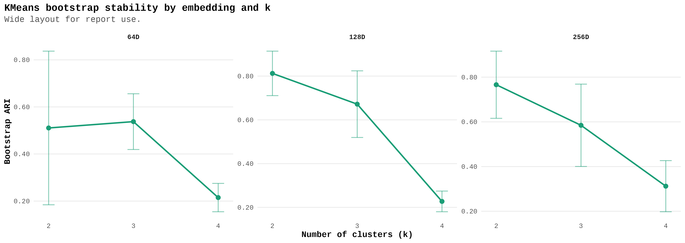
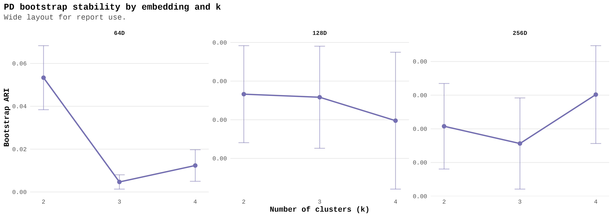
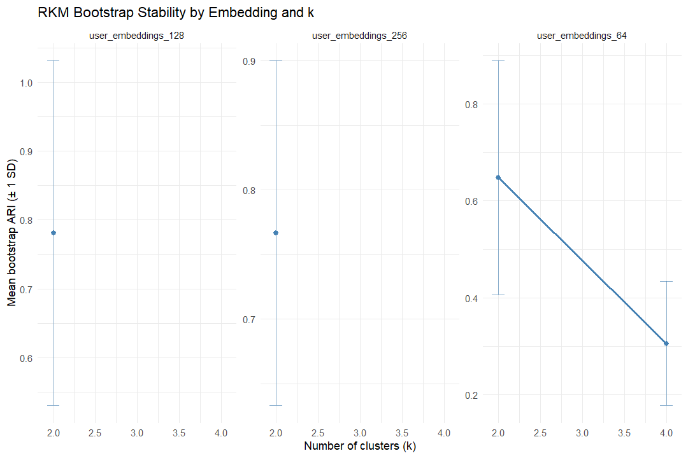
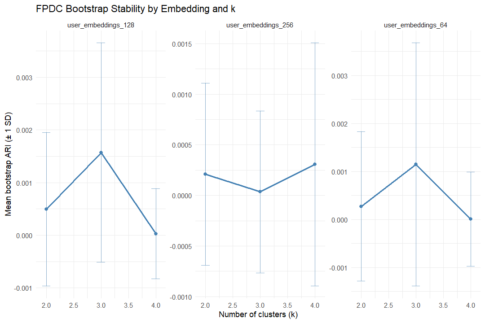

# Stability Analysis

Bootstrap stability was assessed using a common design across all four clustering methods. The 64, 128, and 256 dimensional user embeddings were each evaluated for k = 2, 3, and 4. For every combination of embedding and k, 15 bootstrap replicates were generated by sampling 30% of users with replacement, and the clustering model was re-fitted on each bootstrap subsample before being compared with the corresponding full-data reference partition. Reduced K-means used reference models selected over q = 2:6. FPDC used reference models selected over q = 2:4.

Figure \@ref(fig:kmeans-bootstrap-fig) shows the bootstrap stability profile for K-means across the three embedding sizes. The 128 and 256 dimensional embeddings show the same overall pattern: stability is highest at k = 2, remains moderate at k = 3, and drops sharply at k = 4. The 64 dimensional embedding is less stable overall, with only modest ARI at k = 2 and k = 3 and a similarly large decline at k = 4. Taken together, these results suggest that K-means produces its most reproducible partitions at lower cluster counts, especially for the higher dimensional embeddings, while four cluster solutions appear substantially less stable.

```{r kmeans-bootstrap-fig, echo=FALSE, fig.cap="Bootstrap stability for K-means across embeddings and cluster counts."}

```

Figure \@ref(fig:pd-bootstrap-fig) presents the corresponding bootstrap stability results for PD clustering. In contrast to K-means and RKM, the ARI values are extremely close to zero across nearly all settings, with only a small positive value for the 64-dimensional embedding at k = 2. The 128 and 256 dimensional embeddings show near zero or slightly negative mean ARI throughout, indicating that the bootstrap partitions do not reproduce the full-data clustering in a consistent way. Overall, this figure suggests that PD clustering was the least stable of the four methods under the current parameter settings and data representation.

```{r pd-bootstrap-fig, echo=FALSE, fig.cap="Bootstrap stability for PD clustering across embeddings and cluster counts."}

```

Figure \@ref(fig:rkm-bootstrap-fig) shows the bootstrap stability results for Reduced K-means. The strongest stability appears for k = 2 in the 128 and 256 dimensional embeddings, where mean ARI is high and clearly exceeds the values seen for the 64 dimensional embedding. For the 64 dimensional embedding, stability decreases noticeably when moving from k = 2 to k = 4. The absence of points at k = 3 and k = 4 for the 128- and 256-dimensional embeddings suggests that those settings were either unavailable in the cached results or did not yield valid bootstrap summaries. Among the available results, RKM appears highly stable at k = 2 and compares favorably with standard K-means.

```{r rkm-bootstrap-fig, echo=FALSE, fig.cap="Bootstrap stability for Reduced K-means across embeddings and cluster counts."}

```

Figure \@ref(fig:fpdc-bootstrap-fig) shows the bootstrap stability profile for FPDC. As with PD clustering, the mean ARI values are clustered very close to zero across all embeddings and all values of k, although the estimates are slightly positive in most cases. The 128 and 64 dimensional embeddings show a small local increase at k = 3, while the 256 dimensional embedding remains nearly flat across the tested cluster counts. This pattern indicates that FPDC did not recover highly reproducible partitions under bootstrap resampling, even though its solutions were marginally more stable than PD in some settings. Overall, the figure suggests that FPDC was considerably less stable than K-means and RKM in this analysis.

```{r fpdc-bootstrap-fig, echo=FALSE, fig.cap="Bootstrap stability for FPDC across embeddings and cluster counts."}

```
